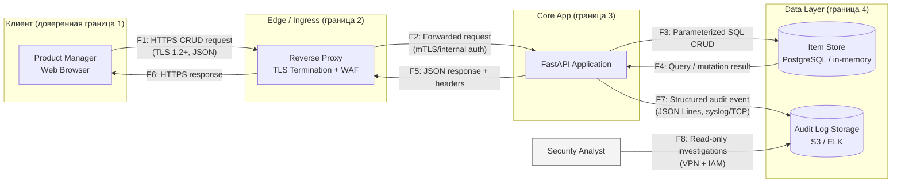

# Data Flow Diagram

## Контекст
- Веб‑клиенты (продуктовые менеджеры) обращаются к API для CRUD-операций над айтемами бэклога.
- Трафик проходит через edge-уровень (reverse proxy / ingress), затем попадает в FastAPI-приложение.
- Приложение использует хранилище (пока in-memory, целевое — управляемая СУБД) и пишет структурированные аудит-логи.
- CI/CD пайплайн запускает проверки безопасности при пушах и PR, что связано с NFR по supply chain.

## Основной сценарий: CRUD через HTTP API



## Альтернативный сценарий: CI/CD и проверки безопасности

```mermaid
flowchart LR
  subgraph Dev_Boundary["Developer Workstation (граница 1)"]
    DEV[Developer]
  end

  subgraph SaaS_Boundary["Git Hosting (граница 2)"]
    GIT[Git Hosting / PR service]
  end

  subgraph CI_Boundary["CI/CD Platform (граница 3)"]
    CI[CI/CD Pipeline<br/>(tests + security scans)]
  end

  DEV -- "F9: Push / PR<br/>(HTTPS/SSH)" --> GIT
  GIT -- "F10: PR webhook + status<br/>(REST + signed payload)" --> CI
```

## Таблица потоков

| Поток | Откуда → Куда | Данные и протокол | Связанные NFR | Комментарий |
|-------|---------------|-------------------|---------------|-------------|
| F1 | Product Manager → Reverse Proxy | HTTPS CRUD запросы, Bearer токены | NFR-S02, NFR-S01 | Браузер инициирует операции; требования к HTTPS и аутентификации. |
| F2 | Reverse Proxy → FastAPI | mTLS / внутренний HTTP, auth headers | NFR-S01, NFR-S07 | Edge проводит проверку и передаёт только валидный трафик; добавляет security headers. |
| F3 | FastAPI → Item Store | Параметризованные SQL/ORM операции | NFR-S09 | Используются safe queries для защиты от инъекций. |
| F4 | Item Store → FastAPI | Результаты запросов | NFR-S09 | Ответы фильтруются и валидируются схемами. |
| F5 | FastAPI → Reverse Proxy | JSON ответы, коды ошибок | NFR-S07 | Контроль защитных заголовков перед отдачей наружу. |
| F6 | Reverse Proxy → Product Manager | HTTPS ответы | NFR-S02, NFR-S07 | Гарантируется шифрование и корректные заголовки в наружном канале. |
| F7 | FastAPI → Audit Log Storage | Структурированные события (JSON Lines/syslog) | NFR-S03 | Фиксация всех мутаций для расследований. |
| F8 | Security Analyst → Audit Log Storage | Read-only запросы, VPN/IPsec | NFR-S03 | Доступ ограничен и проходит по зашифрованным каналам. |
| F9 | Developer → Git Hosting | Push/PR, HTTPS/SSH | NFR-S04, NFR-S06 | Код и конфиги передаются в контролируемый репозиторий; проверка секретов. |
| F10 | Git Hosting → CI/CD Pipeline | Подписанные вебхуки, статусы PR | NFR-S04 | Триггерятся проверки качества/безопасности, блокирующие релиз. |
